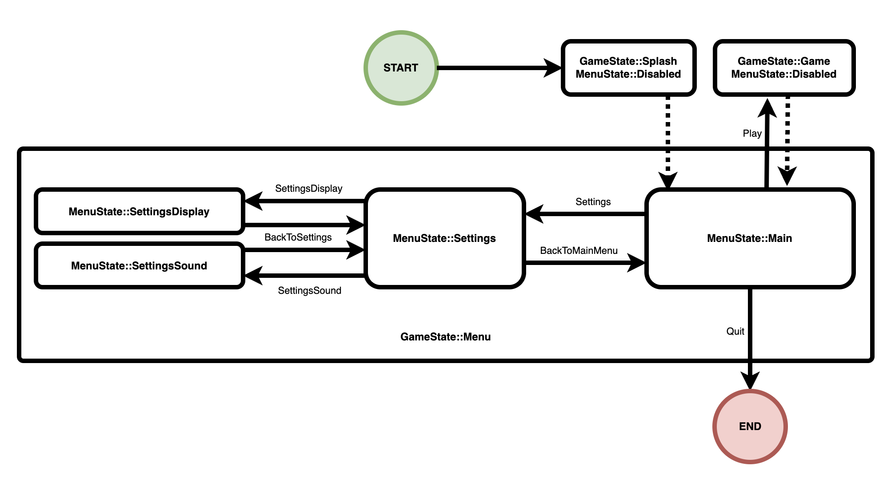

# daily-bevy

Learn [Bevy](https://bevyengine.org/) by exploring a small example (almost) every day.

[Bevy](https://github.com/bevyengine/bevy/) is a free, open-source, cross-platform (Windows, macOS, Linux, Web, iOS, Android) game engine written in [Rust](https://www.rust-lang.org/).

This README shows the first entry in this series. All other entries can be found at [daily-bevy/branches](https://github.com/vroussea/daily-bevy/branches).
Original ones can be found [here](https://github.com/awwsmm/daily-bevy/branches).

### Disclaimer
The goal of this repository will be to follow the tracks of [awwsmm's repo](https://github.com/awwsmm/daily-bevy/blob/master/README.md) that focuses on working on one example from Bevy repo per day.2

## Today's example
Today's focus is going to be on the [`game_menu`](https://github.com/bevyengine/bevy/blob/release-0.12.1/examples/games/game_menu.rs) example example from Bevy's repository.

This example is about resources (that holds game settings), game state (splash screen, menu screen, game screen) in which we can either change the settings or run the game depending on it. And finally about plugins that let us split the code in a lot more modular parts.

I first decided to change the example by adding a new GameState PluginGroup that holds all other plugins, since that's how a game is going to be split, with different groups of plugins holding different logics for different parts of the game. Some could say that the most basics plugins are supposed to be re-usable for other games in some ways ?

Now let's attack the first plugin :

### splash
This plugin only adds 3 different systems, the first difference compared to previous days'examples is with the scheduling of those systems.
We get `OnEnter(GameState::Splash)`, `OnExit(GameState::Splash)` and a normal Update.
OnEnter seems to wait for the given state to be set before calling the system while OnExit waits for exiting that state.
We also have a `.run_if()` on the Update system that checks if we are `in_state(GameSTate::Splash)`. run_if() takes a `Condition`, what is it ?
Here is the definition:
``` rust
/// A system that determines if one or more scheduled systems should run.
///
/// Implemented for functions and closures that convert into [`System<Out=bool>`](crate::system::System)
/// with [read-only](crate::system::ReadOnlySystemParam) parameters.
///
/// # Examples
/// A condition that returns true every other time it's called.
/// ```
/// # use bevy_ecs::prelude::*;
/// fn every_other_time() -> impl Condition<()> {
///     IntoSystem::into_system(|mut flag: Local<bool>| {
///         *flag = !*flag;
///         *flag
///     })
/// }
///
/// # #[derive(Resource)] struct DidRun(bool);
/// # fn my_system(mut did_run: ResMut<DidRun>) { did_run.0 = true; }
/// # let mut schedule = Schedule::default();
/// schedule.add_systems(my_system.run_if(every_other_time()));
/// # let mut world = World::new();
/// # world.insert_resource(DidRun(false));
/// # schedule.run(&mut world);
/// # assert!(world.resource::<DidRun>().0);
/// # world.insert_resource(DidRun(false));
/// # schedule.run(&mut world);
/// # assert!(!world.resource::<DidRun>().0);
/// ```
///
/// A condition that takes a bool as an input and returns it unchanged.
///
/// ```
/// # use bevy_ecs::prelude::*;
/// fn identity() -> impl Condition<(), bool> {
///     IntoSystem::into_system(|In(x)| x)
/// }
///
/// # fn always_true() -> bool { true }
/// # let mut app = Schedule::default();
/// # #[derive(Resource)] struct DidRun(bool);
/// # fn my_system(mut did_run: ResMut<DidRun>) { did_run.0 = true; }
/// app.add_systems(my_system.run_if(always_true.pipe(identity())));
/// # let mut world = World::new();
/// # world.insert_resource(DidRun(false));
/// # app.run(&mut world);
/// # assert!(world.resource::<DidRun>().0);
```
So some kind of filter, `in_state()` seems to be part of a list of functions that gives different kind of common conditions like which state the game currently is in.

So when entering the splash state the splash_setup system is called. It sets up a node with a marker component `OnSplashScreen` that might be used later to remove all the entities related to that state. That nodes has an `ImageBundle` child that take the icon in the assets folder using the `AssetServer`. It also sets the size of the logo in a `Style` component. Then it inserts a resource into the world called SplashTimer, set on 1 second. That will surely change the state of the game during an update once the timer is done.

In the update system of splash we retrieve a mutable resource on the game's state, a time resource and a mutable resource with the timer set in the setup.
We then advance the timer by the time elapsed since last update, and if that ends up finishing the timer, we then change the game state to menu. Pretty simple.

As for the last system, we are using a different system, it is a generic system that takes a query of an entity with a T, T being any type of Component, it also takes a `Commands`. All it does is removing any entity with that T marker component. In our case it is the `OnSplashScreen` marker. Since we left the Splash State.

Now let's advance to our next state:

### menu

The menu `GameState` is the most complex one of all three of them. It has 5 different screens if you count the disabled one. All of them expressed by a new type of states : the ``MenuState``, with disabled being the default.

We have a few marker `Component`s that are used to clean the screen after exiting one of those states. A few constant `Color`s for the buttons, another marker `Component` that is used to mark which setting is selected, and an enum `Component` that allows to give an action to all button clicks.

Here is a diagram on how the FSM (finish state machine) works :



In the `MenuPlugin` build method, we see that the menu `MenuState` will first be disabled, then after splash or game `GameState` are exited for menu `GameState` we go to Main `MenuState`, from which we can then move to settings `MenuState`, game `GameState` (that would disabled `MenuState` again) or exit the App. From the settings `MenuState` we can move back to main `MenuState` or go deeper to the sound and display settings `MenuState, from which we can only go back to settings `MenuState`.

Each Screen related to a `MenuState` has an `OnEnter` and `OnExit` system to, accordingly, setup the screen and clean it. The display and volume settings also have an `Update` system, plus two other `Update` systems that run if the `GameState` is on menu. (Read [awwsmm](https://github.com/awwsmm/daily-bevy/tree/games/game_menu_3) for more info about screen setups and the UI design used here)
Contrary to game and splash states, menu doesn't have an OnExit system, but instead relies on the FSM, since the exit point of menu state is the main `MenuState`.

The button_system allows us change the background color of the different buttons depending on the current interaction with said buttons.

The setting_button allows us to modify an entity that had an `Interaction::Pressed` with a button `Component`and add the `SelectedOption` marker `Component` to it if it isn't already selected, while also removing that marker from the previously selected entity. Then it changes the corresponding setting to the new selected one. This function is generic as it accepts any type T that derives `Resource`, `Component`, `PartialEq` and `Copy`. So `DisplayQuality` or `Volume` that are both settings that can be modified in the menu.

The menu_action binds each button action to state change (in `GameState` and/or `MenuState`) with a special case for Quit which write an `AppExit` event using the `EventWriter<AppExit>` that makes the app exit. This just makes the link between button pressing and the FSM diagram possibilities from earlier.

### game

Compared to menu, this state is pretty straightforward and simple:
- `OnEnter` and `OnExit` schedules
- two systems with one being on Update schedule with a condition for being in `GameState::Game` state.

The first system, game_setup, resemble a lot what we saw in menu state, but this time only having text, and showing the two Resources : Volume and DisplayQuality. It also adds a 5 seconds timer at the end.

The second system looks a lot like what we already saw, it just move the timer by the time since last update, and if the timer is finished it changes the `GameState` to menu

## final word

That was a really big example with lot of different new things inside it. Awwsmm also questions what could be the next steps if we want to learn how to make a proper game. He talks about how to save game maybe by exporting in a file, or saving in a cookie in case of a WASM app. Maybe even having a server to which we would send the save ? He also questions about a possible mobile app.